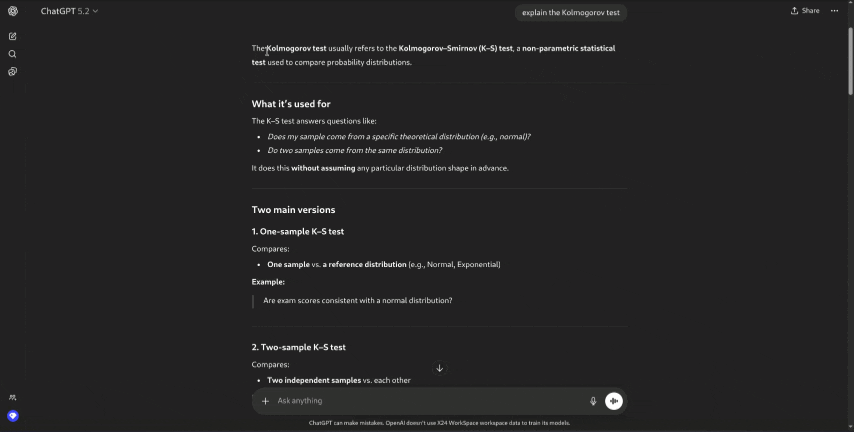

# Anchor Anywhere

Pin a spot on any webpage and jump back to it later.

Anchor Anywhere is a lightweight Chrome extension that lets you select text, pin that location, and instantly jump back to it - even on long pages, chats, and single-page apps.

---

### Demo


---

## ✨ Features

- 📌 **Pin via right-click**  
  Select any text → right-click → *Pin selection*

- 🧭 **Jump back instantly**  
  Open the pins panel and jump to any saved spot

- 🧠 **Works on modern SPAs**  
  Tested on sites like Chatbots, Static pages, and more

- 🗂 **Per-page storage**  
  Pins are stored per page and persist across browser restarts

- 🧹 **Auto cleanup**  
  Old pins are automatically removed after 30 days

- ⌨️ **Keyboard shortcut**  
  Toggle the pins panel with a customizable shortcut

---

## 🚀 Installation (Development)

1. Clone this repository:

   ```bash
   git clone https://github.com/FDamirchi/anchor-anywhere.git
   ```

2. Open Chrome and go to:

    ```bash
    chrome://extensions
    ```

3. Enable Developer mode

4. Click ```Load unpacked``` and select the project folder

---

## 🧑‍💻 How to Use
1. Select any text on a webpage

2. Right-click → Pin selection

3. Open the pins panel (extension icon or keyboard shortcut Alt+A)

4. Click a pin to jump back to that spot


To change the keyboard shortcut, open:
    ```chrome://extensions/shortcuts```

---

## 🗑 Managing Pins
- Pins are stored per page

- Pins persist across browser restarts

- Pins older than 30 days are automatically removed

- Pins can be deleted individually or cleared per page

---

## 🚧 Development Status
**This project is under active development.**

* Features may change

* Bugs and edge cases are expected

* Behavior may differ across websites

Use at your own discretion.

---

## 🤝 Contributing
Contributions are **very welcome**.

- Bug reports

- Feature suggestions

- Pull requests

If you find an issue or have an idea, feel free to open an issue or submit a PR.

---

## 🛠 Tech Notes
- Chrome Extension (Manifest V3)

- Uses chrome.storage.local

- Content scripts run in all frames for SPA support

- No external dependencies

---

Made with ❤️ by Frozen Fedora.